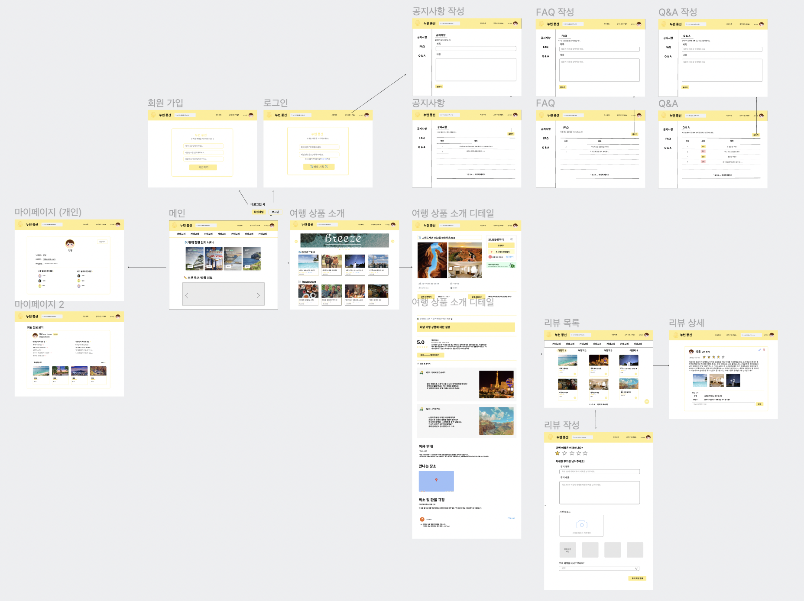
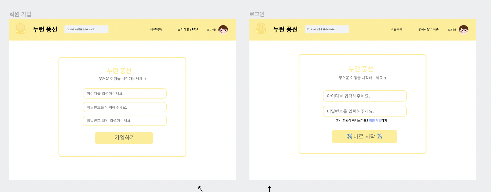
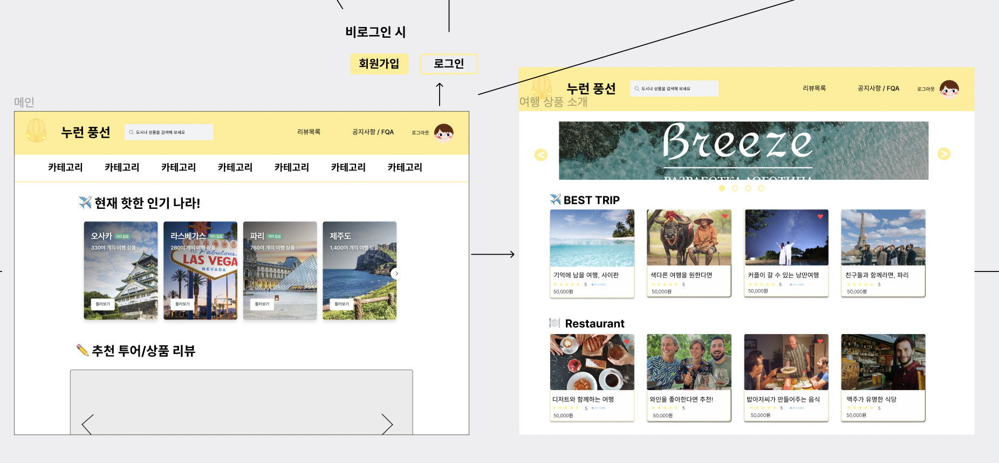
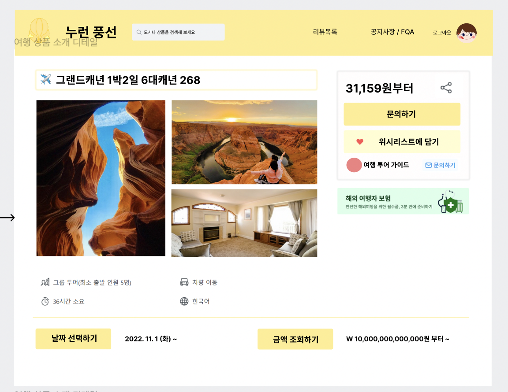
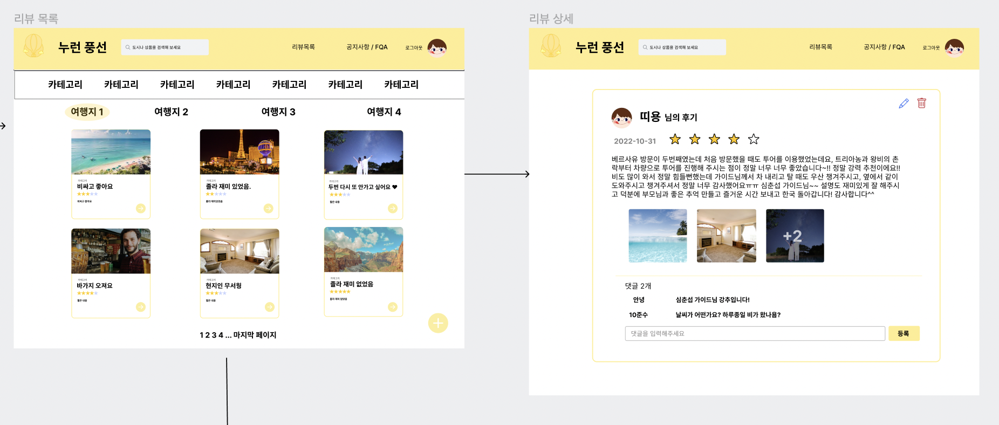
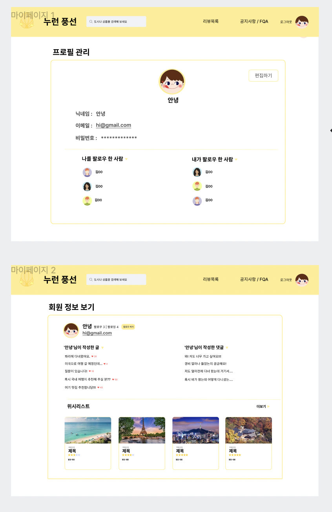
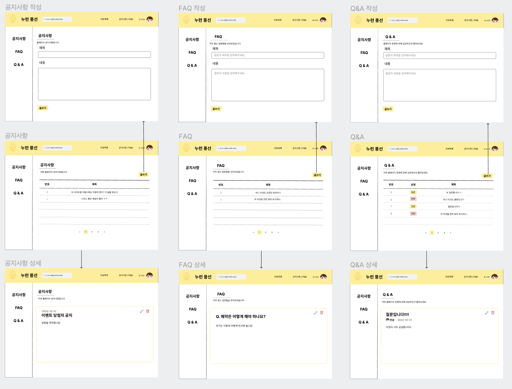

# 누런풍선
### 여행 상품 소개 및 리뷰 커뮤니티 서비스
 

## 업무분담
 

## 사용 기술 및 개발 계획
* Django, HTML, CSS

* `협업 Tool`: Figma, Notion, Discord, GitHub

* `2022.10.31 ~ 2022.11.07`
 

## DB 모델링

 

## 핵심기능

 

#### 1. 여행 상품 소개 
* selenium, BeautifulSoup을 이용하여 마이리얼트립의 여행 상품 제목과 이미지 크롤링 및 템플릿에 출력

* Tab menu 구현, carousel 구현

*  위시리스트 기능 구현

 

#### 2. 리뷰 작성 커뮤니티 및 공지사항
* 게시글 CRUD 구현
    * 게시글 좋아요 / 평점 / 이미지 업로드 / 댓글 생성 및 수정 / 작성 시간 및 수정 시간 
        * 이미지 클릭 시 사진 확대 기능 구현 

* 사용자가 작성한 제목, 내용을 기반으로 검색 기능 구현

 

#### 3. 유저 프로필 
* 회원가입 및 로그인

* 유저 정보 업데이트 

* 프로필 이미지 업로드 및 수정

* 사용자간의 팔로우

* 위시리스트 목록 출력

* 팔로우 및 팔로잉 목록 출력 
 

### Figma 화면 설계

